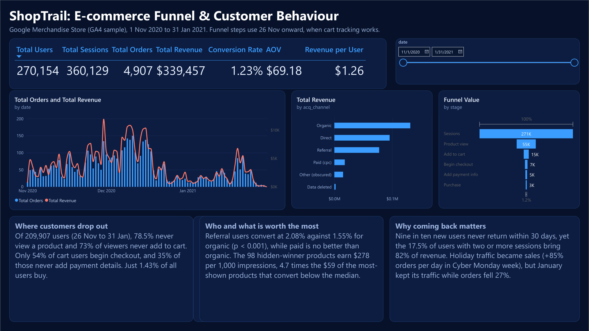
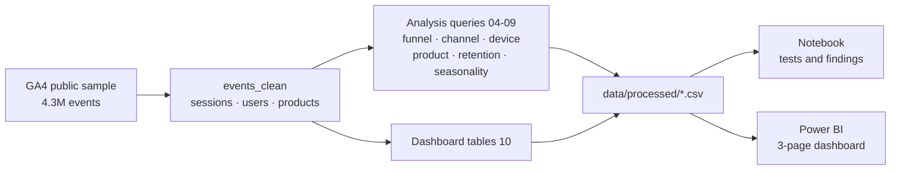
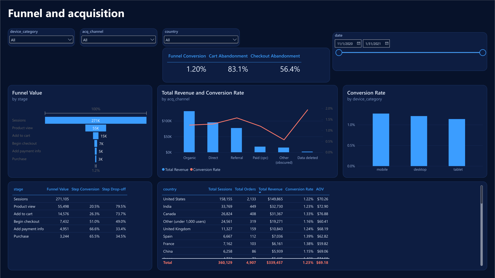
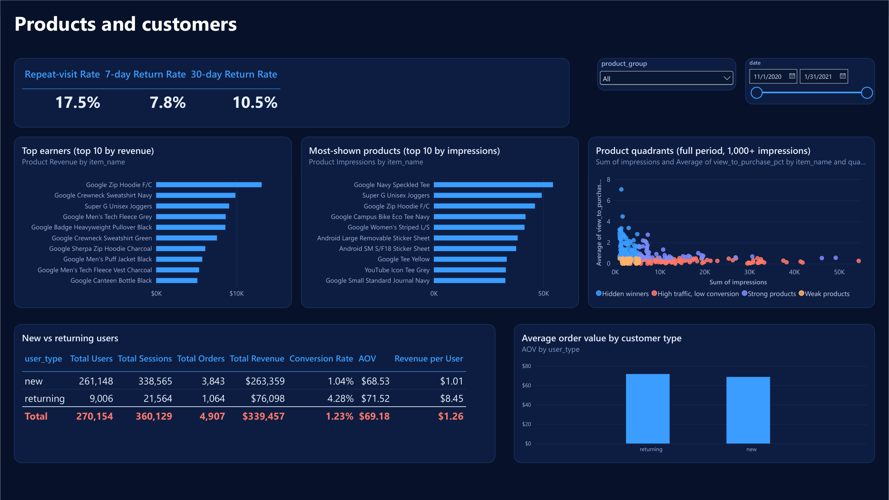

# ShopTrail: E-commerce Funnel & Customer Behaviour Analysis

ShopTrail traces every shopper's path through the Google Merchandise Store, from first visit to purchase, to find where customers leave and what to fix first.

**Stack:** BigQuery SQL · Python (Pandas, NumPy, SciPy, Matplotlib, Seaborn) · Power BI



## 1. Business problem

Where do customers drop out of the purchase journey, which channels and segments bring the most value, and which three problems should the business investigate first?

The output is a reproducible analysis (SQL, a narrative notebook, a three-page Power BI dashboard) that ends in three ranked, evidence-backed recommendations.

## 2. Dataset and caveats

Google's public GA4 sample for the Google Merchandise Store: `bigquery-public-data.ga4_obfuscated_sample_ecommerce.events_*`, one table per day from 1 Nov 2020 to 31 Jan 2021 (92 days).

| Measure | Value |
| --- | --- |
| Events | 4,295,584 |
| Users (`user_pseudo_id`) | 270,154 |
| Sessions | 360,129 |
| Orders (after cleaning) | 4,907 |
| Revenue (after cleaning) | $339,457 |

Things to know before reading any number:

- **It is a sample and it is obfuscated.** Findings describe the sample, not the real store.
- **Obscured traffic source.** 33.5% of events have an unusable `source` and 21.2% an unusable `medium` (`<Other>` or `(data deleted)`). They are shown as their own channel rows and never dropped.
- **Tracking gaps found by checking every day.** `add_to_cart` is missing for most of 1-25 Nov, so every cart step uses 26 Nov onward. Transaction ids are missing until about 11 Nov. From 26 Jan most purchase events lose their revenue. Each gap is handled in the SQL and explained in the notebook.
- **No `user_id`.** Users are identified by `user_pseudo_id`.

## 3. Tech stack

| Layer | Tool | Used for |
| --- | --- | --- |
| Warehouse | BigQuery (sandbox) | Cleaning, sessionising, funnel, channel, product, retention and seasonality tables |
| Analysis | Python 3.11 (Pandas, NumPy, SciPy) | Significance tests, sizing the recommendations |
| Charts | Matplotlib, Seaborn | Notebook figures |
| Dashboard | Power BI Desktop | Three-page interactive report on a small star schema |

## 4. Data pipeline



All heavy work runs in BigQuery. Every result is exported to `data/processed/`, so the notebook and the dashboard run without a Google Cloud account.

## 5. Data quality

Done in `sql/01_data_quality.sql` and the notebook's data understanding section.

- **Orders.** 5,692 raw purchase events become 4,907 orders: one per distinct real `transaction_id` (earliest event), and id-less purchases are kept only when revenue is above zero. The 450 zero-revenue id-less events are excluded and reported.
- **New vs returning.** A user is `new` when their lowest `ga_session_number` is 1. The lowest number is used, not the first session by time, because about 300 users open sessions out of order. This avoids counting people who visited before 1 Nov as new: 261,148 new and 9,006 returning.
- **Channel.** The earliest non-obscured source/medium per user ("first-observed"), because 9.7% of users have two or more different real mediums.
- **Funnel.** Open and user-level: a user counts for a step if that event happened, even if an earlier one was not recorded. A session-level and a strict-sequence version sit beside it.
- **Reconciliation.** Every table is checked against the others (users, sessions, orders and revenue totals match across `02`, `03`, and the dashboard tables).

## 6. Analytical approach

| Analysis | File | What it does |
| --- | --- | --- |
| Funnel | `04_funnel_analysis.sql` | Seven-stage user funnel from 26 Nov, drop-offs, cart and checkout abandonment |
| Channels | `05_channel_analysis.sql` | Conversion and revenue per user by first-observed channel, with z-tests against organic |
| Device and country | `06_device_country_analysis.sql` | Funnel by device, country performance with multiple-comparison correction |
| Products | `07_product_analysis.sql` | Impressions to cart to purchase per product, product groups, "hidden winner" quadrants |
| Retention | `08_customer_retention.sql` | 7-day and 30-day return rates, repeat visitors, value of returners |
| Seasonality | `09_seasonality.sql` | Baseline vs Cyber Monday week vs December vs January, per-day comparison |

Group differences are tested with two-proportion z-tests, and the country comparison uses a multiple-comparison correction.

## 7. Key findings

Funnel numbers use users from 26 Nov 2020, when cart tracking works.

1. **Four in five users never view a product, and 73% of viewers never add to cart.** 21.5% of users view a product, 26.7% of those add to cart, and only **1.43% of users buy**.
2. **About half of cart users never start checkout, and a third of those who do never add payment details.** 54.1% of cart users begin checkout (44.1% in a strict sequence); 34.7% of checkout starters never add payment info.
3. **Referral users are the most valuable and paid users are no better than organic.** Referral converts at **2.08% vs 1.55% for organic** (p < 0.001) and brings $1.82 per user against a $1.26 average. Paid converts at 1.45% (p = 0.36).
4. **The products shown most earn the least per view.** 98 high-traffic, low-converting products get 63.0% of impressions and earn $59 per 1,000, while 98 "hidden winners" get 10.2% of impressions and earn **$278 per 1,000 (4.7 times as much)**.
5. **Nine in ten new users never come back, but those who do carry the revenue.** 10.5% of new users return within 30 days, and the 17.5% of users with two or more sessions bring **82.3% of revenue**.
6. **Holiday traffic turned into sales, then faded.** In the Cyber Monday week 20% more users per day brought **85% more orders**. In January traffic stayed 17% above baseline while orders fell 27%.

**What the data ruled out.** Device is not the problem (mobile 1.27% vs desktop 1.21%, p = 0.11), and no country differs significantly from average after correction, so a mobile checkout redesign or a country-specific fix is not justified by this data.

## 8. Recommendations

Ranked by estimated monthly revenue impact. Each is a scenario, not a forecast: raise one step to the level of the best channel in the sample (referral), count the extra users, value them at what the sample shows, then halve the result.

| Rank | Recommendation | Evidence | Estimated impact |
| --- | --- | --- | --- |
| 1 | **Win back first-time visitors** with a first-week re-engagement programme, run against a holdout group | Only 10.5% of new users return within 30 days; those who do spend $8.32 vs $0.40 | about $9.8K a month (8.9% of revenue) |
| 2 | **Fix the path from cart to payment**: review shipping and tax surprises, forced sign-up, promo-code friction, payment methods | 46-56% of cart users never begin checkout; 34.7% of starters never add payment | about $6.2K a month (5.6% of revenue) |
| 3 | **Improve product discovery**: give hidden winners prominent placement, review the most-shown low converters | The most-shown products earn $59 per 1,000 impressions vs $278 for hidden winners | about $4.1K a month (3.7% of revenue) |

Confidence is lowest for #1 (returners may simply be more engaged people) and #3 (views are impressions). Before testing any of them, fix the three tracking problems listed in the data section. The full reasoning, formulas and caveats are in the notebook.

## 9. Dashboard

Built in Power BI Desktop on six small CSV tables (`10_dash_*.csv`, `07_products.csv`) with four relationships and 28 DAX measures. Slicers for date, device, channel, country and product group; the date slicer is synced across pages. The look comes from a custom dark theme (`dashboard/theme/ShopTrail_Ocean.json`, import it from Design > Themes > Import theme; `ShopTrail_Midnight.json` is a teal and gold alternative). The model script is in `dashboard/model.tmdl` and the report in `dashboard/ShopTrail.pbix`.

| Page | What it answers |
| --- | --- |
| 1. Overview | Headline KPIs, orders and revenue over time, revenue by channel, the funnel, and three key findings |
| 2. Funnel and acquisition | Step-by-step funnel, channel conversion, device and country performance |
| 3. Products and customers | Top products by revenue vs by impressions, product quadrants, repeat-visit and return rates, new vs returning users |





## 10. Limitations

- A three-month sample: findings describe the sample, not the real store or its exact revenue.
- Channel is the first observed acquisition channel, not the source of each visit, and a large share of traffic is obscured.
- No prior-year data and no advertising cost, so seasonality is a within-period comparison and nothing here measures return on ad spend.
- Impact estimates are scenarios built on observational data and stated assumptions, for prioritising tests.
- Product "views" are impressions, product groups are keyword-derived, and up to about 230 orders are missing from 26-31 Jan.
- In the dashboard, the product quadrant chart is fixed to the full period, and cart-related measures only count dates from 26 Nov.

## 11. Project structure

```text
ShopTrail/
├── sql/                     # nine analysis files + 10_dashboard_tables.sql
├── scripts/run_sql.py       # runs a SQL file in BigQuery and exports its result tables
├── data/processed/          # exported query results (CSV), the only input to the notebook and dashboard
├── notebooks/
│   └── ShopTrail_Analysis.ipynb
├── dashboard/
│   ├── ShopTrail.pbix
│   ├── model.tmdl           # tables, relationships and measures
│   ├── theme/               # Power BI theme (colours, fonts, card style)
│   └── screenshots/
├── docs/
│   └── data_dictionary.md
├── requirements.txt
└── README.md
```

Every SQL file opens with a comment naming the business question it answers.

## 12. How to reproduce

**The notebook (no Google Cloud account needed):**

```bash
python -m venv .venv
.venv\Scripts\activate            # macOS/Linux: source .venv/bin/activate
pip install -r requirements.txt
jupyter nbconvert --to notebook --execute --inplace notebooks/ShopTrail_Analysis.ipynb
```

**The dashboard:** open `dashboard/ShopTrail.pbix` in Power BI Desktop. The tables load from CSV files, and the paths in `dashboard/model.tmdl` point at `D:\ShopTrail\data\processed\`. If the repository lives elsewhere, change the source of each table (Transform data, then Data source settings) and refresh.

**The SQL (needs a Google Cloud project; the BigQuery sandbox is enough):**

```bash
pip install google-cloud-bigquery db-dtypes
gcloud auth application-default login
python scripts/run_sql.py sql/01_data_quality.sql --dry-run
python scripts/run_sql.py sql/02_sessions.sql
```

Run the files in this order, because later ones use the tables earlier ones build: `01`, `02`, `03`, `04`, `05`, `06`, `07`, `08`, `09`, `10`. Each query is dry-run first and capped by `--max-gb`. Source data is public, and the scripts only write to a dataset you own.
